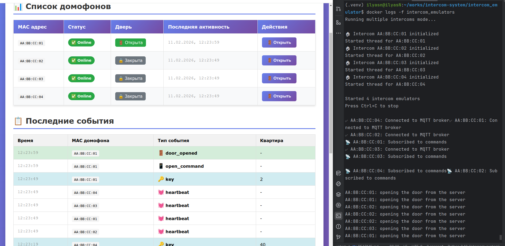

# 🛎️ Intercom System Emulator

Упрощённая модель системы домофона, состоящая из эмуляторов домофонных панелей и сервера событий.  


---

## 📌 Функциональность

Система состоит из двух компонентов:

### 🔹 1. Эмулятор домофона
- Периодически отправляет heartbeat (статус устройства и двери)
- Генерирует события:
  - звонок в квартиру
  - открытие двери по ключу
- Получает команду открытия двери от сервера через MQTT

### 🔹 2. Сервер событий
- Принимает события через MQTT
- Сохраняет их в PostgreSQL
- Отображает события и статус домофонов в веб-интерфейсе оператора
- Позволяет оператору открыть дверь удалённо

---

## 🧩 Реализованные сценарии

| Сценарий | Описание |
|-----------|----------|
| Heartbeat | Домофон каждые 30 секунд отправляет статус |
| Offline detection | Если нет heartbeat > 2 минут — домофон неактивен |
| Call event | Событие звонка в квартиру |
| Key open | Открытие двери по ключу с номером квартиры |
| Server open | Оператор открывает дверь из интерфейса |


---

# 🚀 Запуск проекта

## 1️⃣ Клонировать репозиторий

```bash
git clone git@github.com:Ilyas909/intercom-system.git
cd intercom-system
```

## 2️⃣ Запустить через Docker
```bash
docker compose up --build -d
```


## 3️⃣  Открыть логи эмулятора домофонов 
```bash
cd intercom_emulator
docker logs -f intercom_emulators
```

## 4️⃣ Открыть интерфейс оператора
http://localhost:8000


### Автоматически запускаются 4 домофона:

AA:BB:CC:01

AA:BB:CC:02

AA:BB:CC:03

AA:BB:CC:04

Они:

отправляют heartbeat

генерируют события звонка

эмулируют открытие ключом

### Открытие двери с сервера

В интерфейсе нажать кнопку "Открыть" — команда отправляется через MQTT, домофон подтверждает событие.

### 🖼️ Скриншот работы
